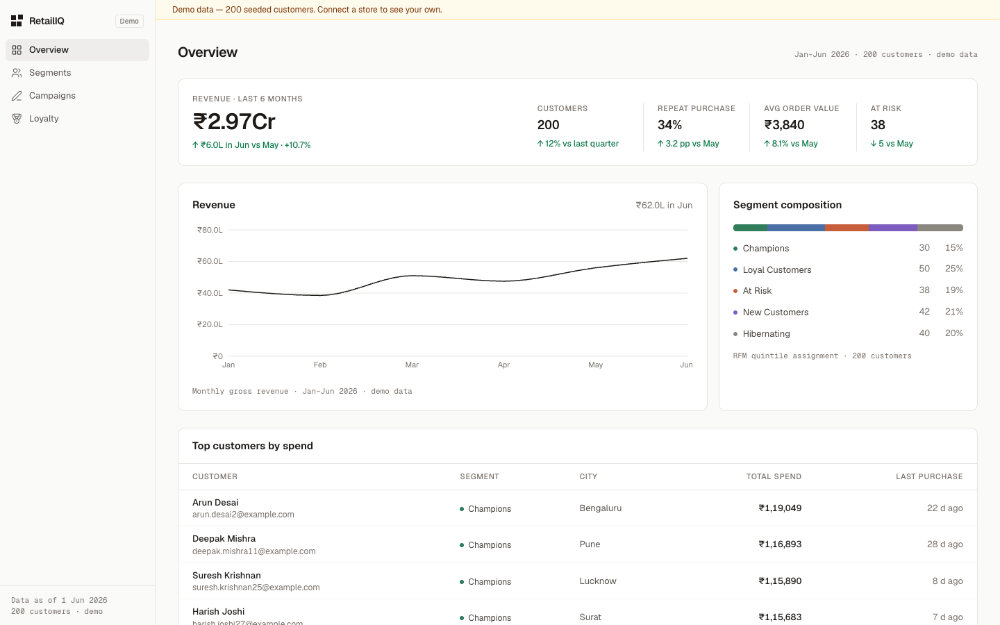
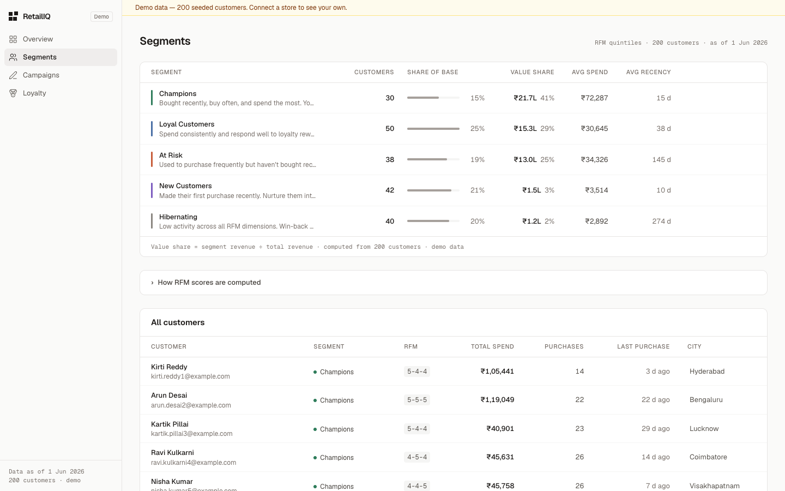
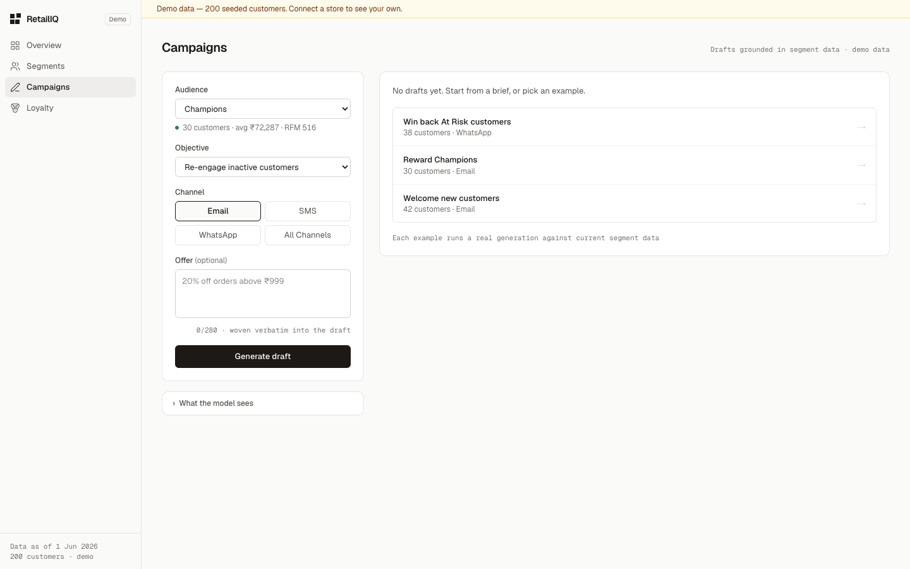
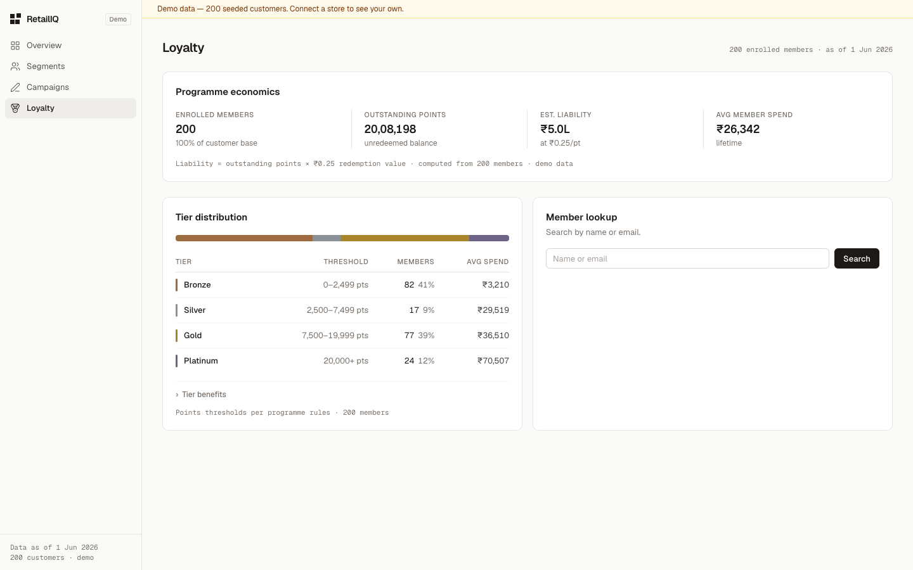
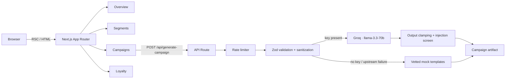

# RetailIQ

Customer intelligence console for retail brands — RFM segmentation, AI-drafted campaigns, and loyalty economics with the evidence to back every number.


---

## Overview

RetailIQ is a customer intelligence console for retention and CRM teams at growing retail brands. It answers the questions that precede every retention decision: which customers are drifting, what they are worth, and what to send them.

Rather than a general-purpose BI tool, each surface answers one standing question. Customers are segmented with RFM (Recency, Frequency, Monetary) quintile scoring, campaign drafts are generated against live segment statistics by Groq's `llama-3.3-70b-versatile`, and loyalty analytics surface the numbers a finance team asks about — including outstanding points liability.

Every computed figure carries a provenance line stating its source, basis, and timestamp. Demo data is disclosed structurally, in the pattern of Stripe's test mode.

The interface implements the **Ledger** design language: warm-stone neutrals, ink-primary actions, a single restrained accent, tabular numerals, and Indian financial notation (lakh/crore) as a first-class citizen.

## Features

### Overview

- Hero revenue metric with month-over-month delta and stated comparison basis
- Supporting metrics (customers, repeat purchase rate, average order value, at-risk count) as a hairline-separated inline row
- Six-month revenue trend as a single-series ink line chart — no gradients, direct value flags on hover
- Segment composition as a horizontal stacked bar with direct labels and click-through to Segments
- Top customers table with tabular numerals and relative purchase recency

### Segments

- Segment Ledger: one row per cohort with population, share-of-base bars on a common scale, value share in rupees and percent, average spend, and average recency
- Hover-revealed "Draft campaign" action carrying full segment context into the composer
- RFM methodology disclosure documenting the quintile scoring and segment assignment rules
- Full 200-customer table with monospaced RFM scores and per-dimension hover explanations

### Campaigns

- Brief composer: audience with live segment evidence, objective, channel, and optional offer
- "What the model sees" disclosure showing the exact context sent to the model
- One-click example briefs that run real generations from the empty state
- Artifact cards with send timing, predicted open rate (with stated basis), personalisation guidance, and a provenance line naming the model, segment, and generation time
- Graceful degradation: 25 hand-written per-segment templates serve as the fallback when no API key is configured or the upstream call fails

### Loyalty

- Programme economics: enrolled members, outstanding points, estimated liability in rupees (with stated redemption basis), and average member spend
- Tier distribution strip and ledger across Bronze, Silver, Gold, and Platinum
- Member lookup with typeahead, tier progress meter, and exact points-to-next-tier

### Security

- Per-IP and global rate limiting with abuse-strike escalation
- Strict schema validation (Zod), request size caps, and server-side input sanitization
- Prompt-injection mitigation with output screening
- Hardened HTTP security headers; API key verified absent from client bundles

### Analytics

- 200 deterministic seeded customers (mulberry32 PRNG) — identical data across server and client renders, zero hydration drift
- RFM quintile scoring with composite segment assignment
- Consistent numeric conventions: compact Indian notation in summaries and axes, full en-IN grouping in tables
- Lighthouse (production build): Performance 95–99, Accessibility 100, Best Practices 100, SEO 100 across all four pages

## Screenshots

| Overview | Segments |
|---|---|
|  |  |

| Campaigns | Loyalty |
|---|---|
|  |  |

## Architecture

- **Next.js 16 (App Router)** — server components render all data surfaces; client components are limited to interactive islands (composer, lookup, charts). Turbopack builds.
- **TypeScript (strict)** — a single `types/index.ts` is the source of truth for segments, tiers, channels, and campaign shapes; enums flow into both UI and API validation.
- **Tailwind CSS 4** — design tokens defined in CSS (`globals.css`), no config file; the Ledger palette maps onto warm-stone neutrals.
- **Recharts** — used only where a charting library earns its weight (the revenue line); composition bars are pure CSS and server-rendered.
- **Groq** — OpenAI-compatible chat completions against `llama-3.3-70b-versatile` with `response_format: json_object`, called exclusively from a server route. Sub-second median generation latency.
- **Vercel** — serverless deployment target; the generation route declares `maxDuration = 30` with an internal 20s upstream timeout so it degrades to templates before the function limit.



## Security

| Control | Implementation |
|---|---|
| Rate limiting | 10 generations/min per IP, 100/min per-instance global backstop, `429` with `Retry-After`; 5 invalid requests/min triggers a temporary abuse block |
| Input validation | Zod strict schema — enum-checked segment/goal/channel, unknown keys rejected, offer capped at 280 chars server-side |
| API protection | 2 KB request body limit (`413`), malformed JSON rejected (`400`), POST-only route, no error detail leakage (failures degrade to templates) |
| Prompt injection | User text is control-character-stripped, delimited as `<offer>` data with explicit system-prompt instructions, and generated output is screened — flagged drafts are discarded for vetted templates. The API key is never part of model context and cannot leak through generation |
| Environment handling | `server-only` import guard; key read exclusively in the API route; verified absent from `.next/static` client bundles; `.env*` git-ignored with `.env.example` explicitly allowed |
| Security headers | CSP, `X-Frame-Options: DENY`, `X-Content-Type-Options: nosniff`, `Referrer-Policy`, `Permissions-Policy`, HSTS; `X-Powered-By` disabled |
| Cost controls | `max_tokens: 700` per generation, single retry on connection errors only, 20s upstream timeout, singleton client |

## Tech Stack

| Layer | Technology | Version |
|---|---|---|
| Framework | Next.js (App Router, Turbopack) | 16.2.7 |
| UI library | React | 19.2.4 |
| Language | TypeScript (strict) | 5.x |
| Styling | Tailwind CSS | 4.x |
| Charts | Recharts | 3.8.x |
| Icons | Lucide React | 1.17.x |
| AI | Groq SDK (`llama-3.3-70b-versatile`) | 1.2.x |
| Validation | Zod | 4.x |
| Fonts | Geist Sans, Geist Mono | via `next/font` |

## Getting Started

**Prerequisites:** Node.js 20+

```bash
# Clone
git clone https://github.com/HXRIkumar/retailiq.git
cd retailiq

# Install
npm install

# Environment (optional — the app runs in demo mode without a key)
cp .env.example .env
# then add your key from https://console.groq.com/keys

# Run locally
npm run dev
# open http://localhost:3000

# Production build
npm run build
npm start

# Lint
npm run lint
```

## Environment Variables

| Variable | Required | Description |
|---|---|---|
| `GROQ_API_KEY` | No | Groq API key. When unset, campaign generation serves pre-written per-segment templates and the UI labels output as demo mode. |

`.env.example`:

```bash
# Groq API key — https://console.groq.com/keys
# Optional: leave unset to run in demo mode with pre-written campaign templates.
GROQ_API_KEY=
```

Never commit `.env` — it is git-ignored by default.

## Deployment

1. Push the repository to GitHub.
2. Import the project at [vercel.com/new](https://vercel.com/new) — Next.js is detected automatically; no build configuration is required.
3. In **Settings → Environment Variables**, add `GROQ_API_KEY` (omit it to deploy in demo mode).
4. Deploy. The generation route requires `maxDuration = 30`, which is declared in code; on the Hobby tier, reduce expectations accordingly or rely on the 20-second internal timeout.

## Project Structure

```
retailiq/
├── app/
│   ├── api/generate-campaign/route.ts   # Hardened Groq generation endpoint
│   ├── dashboard/                       # Overview — hero metric, trend, composition
│   ├── segments/                        # Segment Ledger + customer table
│   ├── copilot/                         # Campaigns — brief composer + artifacts
│   ├── loyalty/                         # Programme economics + member lookup
│   ├── layout.tsx                       # Shell: sidebar, demo banner, fonts
│   └── globals.css                      # Ledger design tokens (Tailwind 4)
├── components/
│   ├── charts/                          # RevenueChart, SegmentCompositionBar
│   ├── copilot/CopilotClient.tsx        # Composer state machine
│   ├── loyalty/CustomerLookup.tsx       # Typeahead member search
│   ├── CampaignOutput.tsx               # Artifact card with provenance
│   ├── DemoBanner.tsx                   # Structural demo-data disclosure
│   ├── Provenance.tsx                   # Provenance line + Delta primitives
│   └── Sidebar.tsx                      # Navigation (desktop + mobile)
├── lib/
│   ├── mock-data.ts                     # 200 seeded customers, segment/tier stats
│   ├── mock-campaigns.ts                # 25 fallback templates (segment × goal)
│   ├── rate-limit.ts                    # In-memory limiter + abuse strikes
│   └── utils.ts                         # INR formatting, Ledger palettes
└── types/index.ts                       # Single source of truth for all types
```

## Roadmap

- Command palette — global navigation, customer search, and actions
- Segment drill-down — row expansion with cohort entry/exit and segment migration view
- Advanced loyalty analytics — redemption rates, tier movement, liability trend
- Streaming generation — token-by-token artifact rendering
- Draft history — persistent campaign artifacts per session
- Distributed rate limiting — Upstash Redis for hard global guarantees
- Multi-store support — workspace switching across storefronts
- Authentication — required before any real customer data replaces the demo dataset

## Author

**Sai pavan**


## License

MIT
